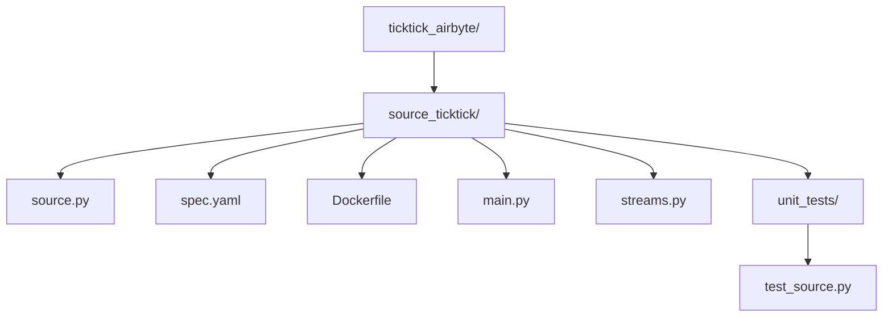

# Handoff Document: TickTick Airbyte Connector POC

This document provides a detailed overview of the TickTick Airbyte connector Proof of Concept (POC), including its architectural design, the rationale behind key decisions, and a detailed plan for future development.

## 1. Project Overview

The primary goal of this project is to build a custom Airbyte source connector for TickTick and eventually deploy it on a free-tier Google Cloud Platform (GCP) instance. This connector will enable users to extract data from their TickTick accounts into various destinations supported by Airbyte.

## 2. Architectural Design

### 2.1. Project Structure

The connector's code is organized within a dedicated `source_ticktick/` subdirectory. This structure adheres to Airbyte CDK best practices for modularity and efficient Dockerization.

**Rationale for `source_ticktick/` subdirectory:**

*   **Modularity and Encapsulation:** Ensures the TickTick connector's code and resources are self-contained and isolated from the broader project, improving organization and maintainability.
*   **Dockerization and Deployment:** Facilitates efficient Docker image creation by allowing the `Dockerfile` to copy only the necessary connector files, resulting in smaller, more efficient images.
*   **Clear Entry Point:** Provides a well-defined entry point (`source_ticktick/main.py`) for the Airbyte platform to execute the connector's logic.

### 2.2. Dependency Management

Dependencies are managed using `uv` and defined in the root `pyproject.toml`. The `Dockerfile` is configured to use `uv sync` to install these dependencies within the Docker image.

## 3. POC Rationale and Implementation Strategy

Initially, a broader implementation plan was considered. However, a pivot to a minimal Proof of Concept (POC) was decided upon due to the interactive nature of the `dida365` library's OAuth2 authentication flow.

### 3.1. The `dida365` Authentication Challenge

The `dida365` Python client's `authenticate()` method is designed to start a local web server and open a browser for user interaction to complete the OAuth2 flow. This is incompatible with a non-interactive Airbyte connector environment.

### 3.2. POC Solution: Pre-generated Access Token

To overcome this for the POC, the strategy is to:
*   **Require a pre-generated `access_token`:** The connector's configuration (`spec.yaml`) will now include a required `access_token` field.
*   **Manual Token Setting:** The `Dida365Client` instance within the connector will be initialized with the `client_id` and `client_secret`, and then the `access_token` will be manually set using `client.http.set_token()`. This bypasses the interactive OAuth flow, allowing us to focus on data extraction.

### 3.3. Simplest Data Endpoint: Projects

The `get_projects()` method from the `dida365` client was identified as the simplest endpoint for the POC. It requires no parameters and returns a list of all projects, making it ideal for:
*   Verifying connection in the `check` method.
*   Extracting initial data in the `read` method.

## 4. Detailed POC Plan

The following steps outline the remaining work for the minimal POC:

*   **4.1. Revise Connector Configuration (`spec.yaml`)**
    *   **Status:** Completed.
    *   **Details:** Removed `username` and `password` fields. Added a required `access_token` field.
*   **4.2. Simplify the Streams**
    *   **Status:** Completed.
    *   **Details:** Modified `source_ticktick/source.py` and `source_ticktick/streams.py` to define only one stream: `Projects`.
*   **4.3. Implement the `check` Method (POC Version)**
    *   **Status:** In Progress.
    *   **Action:** Modify the `check` method in `source_ticktick/source.py`.
    *   **Details:** Initialize `Dida365Client` with `client_id` and `client_secret`. Manually set the client's token using the `access_token` from the config. Call `client.get_projects()` to verify connectivity. Handle exceptions for failed connections.
*   **4.4. Implement the `discover` Method (POC Version)**
    *   **Status:** Pending.
    *   **Action:** Add a `discover` method to `SourceTicktick` in `source_ticktick/source.py`.
    *   **Details:** Return a hardcoded schema for the `Projects` stream, based on the `Project` model fields from `dida365`.
*   **4.5. Implement the `read` Method (POC Version)**
    *   **Status:** Pending.
    *   **Action:** Implement the `read` method within the `Projects` stream class in `source_ticktick/streams.py`.
    *   **Details:** Call `client.get_projects()` using the authenticated client. Iterate through the returned projects and `yield` each as an `AirbyteRecordMessage`.
*   **4.6. Build the connector as a Docker image.**
    *   **Status:** Pending.
    *   **Action:** Execute `docker build -t tickbyte -f source_ticktick/Dockerfile .` from the root directory.
*   **4.7. Push the Docker image to a Docker registry.**
    *   **Status:** Pending.
    *   **Action:** Authenticate with a chosen registry (e.g., Docker Hub, Google Artifact Registry), tag the image, and push it.
*   **4.8. Plan the deployment of the connector on a free-tier GCP instance.**
    *   **Status:** Pending.
    *   **Details:** Focus on Cloud Run for serverless deployment.
*   **4.9. Deploy the connector on GCP.**
    *   **Status:** Pending.
    *   **Details (assuming Cloud Run):** Enable Cloud Run API, deploy the Docker image, configure environment variables, and set up a trigger.
*   **4.10. Test the deployed connector.**
    *   **Status:** Pending.
    *   **Details:** Monitor Cloud Run logs and verify data in the destination.

## 5. Current Status

The project is currently in the "Implement the `check` Method (POC Version)" phase. The foundational project structure, environment setup, and initial configuration adjustments for the POC are complete.

## 6. Next Steps

The immediate next step is to implement the `check` method in `source_ticktick/source.py` to validate the provided access token by attempting to fetch projects using the `dida365` client.